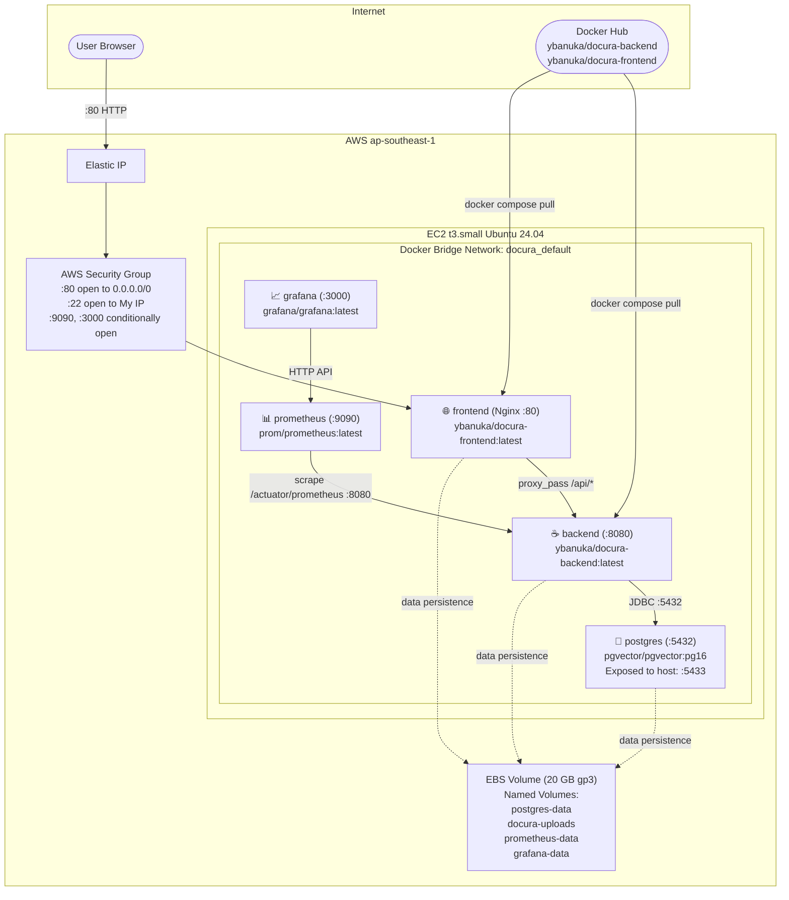

# 🐳 Docura Deployment: Infrastructure Deep Dive

> **Intelligence for Your Documents** — A complete technical reference for the Docura production infrastructure on AWS, covering networking, container orchestration, secrets management, and TLS considerations.

---

## Table of Contents
1. [Infrastructure Overview](#1-infrastructure-overview)
2. [AWS EC2 Instance Specification](#2-aws-ec2-instance-specification)
3. [Docker Compose — Service Catalogue](#3-docker-compose--service-catalogue)
4. [Nginx Reverse Proxy Design](#4-nginx-reverse-proxy-design)
5. [Persistent Storage Strategy](#5-persistent-storage-strategy)
6. [Environment Variables & Secrets](#6-environment-variables--secrets)
7. [AWS Security Group Rules](#7-aws-security-group-rules)
8. [Container Startup Order & Dependencies](#8-container-startup-order--dependencies)
9. [Upgrade & Rollback Procedures](#9-upgrade--rollback-procedures)
10. [TLS/HTTPS Roadmap](#10-tlshttps-roadmap)

---

## 1. Infrastructure Overview

Docura's production deployment is a **single-host Docker Compose stack** on an AWS EC2 `t3.small` instance. All 5 services run on a shared Docker bridge network (`docura_default`), enabling service-to-service communication via container name resolution (DNS).



---

## 2. AWS EC2 Instance Specification

| Property | Value |
|---|---|
| **Instance type** | `t3.small` |
| **vCPU** | 2 |
| **RAM** | 2 GB |
| **Architecture** | `x86_64` |
| **OS** | Ubuntu Server 24.04 LTS |
| **Storage** | 20 GB `gp3` EBS (3000 IOPS, 125 MB/s baseline) |
| **Region** | Configurable (recommended: closest to user base) |
| **Network** | Elastic IP for stable public addressing |

> **Why `t3.small`?** The ONNX embedding model (`all-MiniLM-L6-v2`) is loaded into JVM memory at startup and requires ~400 MB. Spring Boot itself needs ~300 MB. Combined with PostgreSQL and monitoring, `t3.small` (2 GB) is the minimum viable instance. For production traffic beyond 50 concurrent users, upgrade to `t3.medium` (4 GB).

---

## 3. Docker Compose — Service Catalogue

The complete `docker-compose.yml` deploys 5 services. Key design decisions are documented below.

### `postgres` — Vector Database

```yaml
image: pgvector/pgvector:pg16
container_name: docura-postgres
environment:
  POSTGRES_USER: ${DB_USERNAME:-postgres}
  POSTGRES_PASSWORD: ${DB_PASSWORD:-postgres}
  POSTGRES_DB: docura
ports:
  - "5433:5432"     # Host 5433 → Container 5432 (avoids conflict with local Postgres)
volumes:
  - postgres-data:/var/lib/postgresql/data
restart: unless-stopped
```

**Why `pgvector/pgvector:pg16` instead of `postgres:16`?** The `pgvector` extension requires native C compilation. Using the pre-built `pgvector/pgvector` image ensures the extension is correctly compiled and available without any manual installation step.

**First-run only** — enable the extension:
```bash
docker exec -it docura-postgres psql -U postgres -d docura \
  -c "CREATE EXTENSION IF NOT EXISTS vector;"
```

---

### `backend` — Spring Boot API

```yaml
image: ybanuka/docura-backend:latest
container_name: docura-backend
depends_on:
  - postgres
environment:
  - SPRING_PROFILES_ACTIVE=${SPRING_PROFILES_ACTIVE:-prod}
  - DB_URL=jdbc:postgresql://postgres:5432/docura   # internal DNS
  - DB_USERNAME=${DB_USERNAME:-postgres}
  - DB_PASSWORD=${DB_PASSWORD:-postgres}
  - JWT_SECRET=${JWT_SECRET}
  - GROQ_API_KEY=${GROQ_API_KEY}
volumes:
  - docura-uploads:/app/uploads
restart: unless-stopped
```

**Critical detail**: `DB_URL` uses `postgres` (the service name) NOT `localhost`. Docker's internal DNS resolves `postgres` → the database container's IP automatically.

**No exposed port**: Port `8080` is intentionally NOT mapped to the host. It is only reachable by other containers on the Docker network (primarily Nginx for API proxying and Prometheus for scraping).

---

### `frontend` — Nginx + React SPA

```yaml
image: ybanuka/docura-frontend:latest
container_name: docura-frontend
depends_on:
  - backend
ports:
  - "80:80"     # Only container exposed to the public internet
volumes:
  - ./nginx.conf:/etc/nginx/conf.d/default.conf:ro   # :ro = read-only mount
restart: unless-stopped
```

The `nginx.conf` is mounted as a **read-only bind mount** from the host. This means Nginx config can be updated by editing `nginx.conf` on the host and restarting only the frontend container — no image rebuild required.

---

### `prometheus` — Metrics Scraper

```yaml
image: prom/prometheus:latest
container_name: docura-prometheus
volumes:
  - ./prometheus.yml:/etc/prometheus/prometheus.yml:ro
  - prometheus-data:/prometheus
ports:
  - "9090:9090"
depends_on:
  - backend
restart: unless-stopped
```

Scrape configuration (`prometheus.yml`):
```yaml
global:
  scrape_interval: 15s

scrape_configs:
  - job_name: 'docura-spring-boot'
    metrics_path: '/actuator/prometheus'
    static_configs:
      - targets: ['backend:8080']   # Internal Docker DNS
```

---

### `grafana` — Dashboard

```yaml
image: grafana/grafana:latest
container_name: docura-grafana
volumes:
  - grafana-data:/var/lib/grafana
environment:
  - GF_SECURITY_ADMIN_PASSWORD=admin   # Change on first login
ports:
  - "3000:3000"
depends_on:
  - prometheus
restart: unless-stopped
```

> ⚠️ **Change the default `admin` password on first login.** The `GF_SECURITY_ADMIN_PASSWORD=admin` is a Docker Compose default only.

---

## 4. Nginx Reverse Proxy Design

The full `nginx.conf` and the rationale for every directive:

```nginx
server {
    listen 80;
    server_name localhost;

    root /usr/share/nginx/html;    # React build output (from multi-stage Dockerfile)
    index index.html;

    # === API PROXY ===
    location /api/ {
        proxy_pass http://backend:8080/api/;      # Internal container DNS
        proxy_set_header Host $host;
        proxy_set_header X-Real-IP $remote_addr;  # Preserve original client IP
        proxy_set_header X-Forwarded-For $proxy_add_x_forwarded_for;

        # SSE (Server-Sent Events) — CRITICAL for RAG streaming ↓
        proxy_set_header Connection '';       # Clears "Connection: upgrade" header
        proxy_http_version 1.1;              # Keep-alive required for SSE
        chunked_transfer_encoding off;       # Disable chunking for SSE
        proxy_buffering off;                 # MUST be off — otherwise Nginx buffers
        proxy_cache off;                     #   entire SSE response before sending
    }

    # === SPA FALLBACK ===
    location / {
        try_files $uri $uri/ /index.html;    # React Router client-side routing
    }
}
```

**Why `proxy_buffering off` is non-negotiable for SSE:**  
Groq streams LLaMA responses as a `text/event-stream`. Without `proxy_buffering off`, Nginx would collect the entire stream response in memory before forwarding it to the browser — defeating the purpose of streaming and causing users to see a blank screen for 15-30 seconds before the full answer appears all at once.

**Why `try_files $uri $uri/ /index.html`:**  
Without this directive, navigating directly to `http://your-server/chat` (or pressing F5 on any page) would return `404 Not Found` because the file `/chat` doesn't exist on disk. This directive tells Nginx to serve `index.html` for any unmatched route, letting React Router handle it client-side.

---

## 5. Persistent Storage Strategy

All stateful data is stored in **Docker named volumes**, which are managed by Docker and survive container restarts and recreation.

| Volume | Container Mount | Data Stored |
|---|---|---|
| `postgres-data` | `/var/lib/postgresql/data` | All PostgreSQL databases (users, documents, vectors, conversations) |
| `docura-uploads` | `/app/uploads` | Original uploaded files (PDF/DOCX/TXT) keyed by UUID filename |
| `prometheus-data` | `/prometheus` | Time-series metrics data (15-day retention by default) |
| `grafana-data` | `/var/lib/grafana` | Dashboard definitions, data source configs, user accounts |

**Critical rule**: Never run `docker compose down -v` unless you intend to destroy all data. A bare `docker compose down` stops containers while preserving all volumes.

```bash
docker compose down     # Safe: stops containers, volumes intact
docker compose down -v  # DESTRUCTIVE: stops containers AND deletes volumes
```

---

## 6. Environment Variables & Secrets

All secrets are provided via a `.env` file in the same directory as `docker-compose.yml`. Docker Compose loads this file automatically.

```env
# .env — Never commit this file to version control
DB_USERNAME=docura_admin
DB_PASSWORD=<generate: openssl rand -base64 32>
JWT_SECRET=<generate: openssl rand -hex 64>
GROQ_API_KEY=gsk_<your-groq-api-key>
SPRING_PROFILES_ACTIVE=prod
```

**`.env.example`** (committed to version control — no real values):
```env
DB_USERNAME=
DB_PASSWORD=
JWT_SECRET=
GROQ_API_KEY=
SPRING_PROFILES_ACTIVE=prod
```

**Generating secure values:**
```bash
# DB_PASSWORD (32 bytes, base64)
openssl rand -base64 32

# JWT_SECRET (64 hex chars = 256 bits, required for HS256)
openssl rand -hex 64
```

**Security posture**: `.env` is in `.gitignore`. Secrets are never in the Docker image or compose file. The compose file uses `${VAR}` references that resolve only at runtime.

---

## 7. AWS Security Group Rules

| Direction | Port | Protocol | Source | Purpose |
|---|---|---|---|---|
| **Inbound** | `22` | TCP | `<Your IP>/32` | SSH — restrict to your IP only |
| **Inbound** | `80` | TCP | `0.0.0.0/0` | Public HTTP (Nginx reverse proxy) |
| **Inbound** | `9090` | TCP | `<Your IP>/32` | Prometheus UI — only when needed |
| **Inbound** | `3000` | TCP | `<Your IP>/32` | Grafana UI — only when needed |
| **Outbound** | All | All | `0.0.0.0/0` | Outbound (Groq API, Docker Hub, pgvector downloads) |

**Ports deliberately NOT exposed:**

| Port | Service | Why Hidden |
|---|---|---|
| `8080` | Spring Boot backend | Proxied exclusively through Nginx |
| `5432/5433` | PostgreSQL | Database must never be internet-accessible |

---

## 8. Container Startup Order & Dependencies

Docker Compose respects `depends_on` only for **startup order**, not health checks. The actual startup sequence is:

```
postgres → backend → frontend → prometheus → grafana
```

**Important caveat**: `depends_on: postgres` means Docker starts `postgres` before `backend`, but Spring Boot may fail if PostgreSQL has not finished initializing. The `restart: unless-stopped` policy handles this: if the backend crashes during startup (because Postgres isn't ready), Docker automatically restarts it within seconds.

For production hardening, add a health check to the `postgres` service:
```yaml
postgres:
  healthcheck:
    test: ["CMD-SHELL", "pg_isready -U postgres"]
    interval: 5s
    timeout: 5s
    retries: 5

backend:
  depends_on:
    postgres:
      condition: service_healthy   # Wait for health check, not just start
```

---

## 9. Upgrade & Rollback Procedures

### Standard Upgrade (No Downtime)

```bash
# Pull latest images from Docker Hub
docker compose pull

# Recreate containers with new images
# (compose restarts each service individually — brief interruption per service)
docker compose up -d

# Verify new image hashes are running
docker inspect docura-backend --format '{{.Image}}'
docker inspect docura-frontend --format '{{.Image}}'
```

### Emergency Rollback

If a new image causes issues, roll back to the previous image:

```bash
# Option 1: Pin to a specific image tag (best practice)
# In docker-compose.yml, change:
#   image: ybanuka/docura-backend:latest
# to:
#   image: ybanuka/docura-backend:v1.2.0

# Option 2: Force pull the previous digest
docker pull ybanuka/docura-backend@sha256:<previous-digest>
docker compose up -d
```

> **Best practice**: Tag your Docker images with version numbers (e.g., `:v1.0`, `:v1.1`) and keep `:latest` as a convenience alias. This enables reliable rollbacks.

---

## 10. TLS/HTTPS Roadmap

The current deployment serves over HTTP only. For a production environment with real users, HTTPS is required. The recommended upgrade path:

### Option A: Nginx + Certbot (Let's Encrypt) — Free

```bash
# Install Certbot
sudo apt install certbot python3-certbot-nginx

# Obtain certificate (requires a domain name pointing to your EC2 IP)
sudo certbot --nginx -d docura.yourdomain.com

# Auto-renewal (runs every 12 hours, renews if <30 days to expiry)
sudo systemctl enable certbot.timer
```

Then update `nginx.conf` to redirect HTTP → HTTPS and serve on `:443`.

### Option B: AWS Application Load Balancer — Managed TLS

1. Create an ALB with an HTTPS listener.
2. Attach an ACM (AWS Certificate Manager) certificate.
3. Forward traffic to the EC2 instance on port 80.
4. Update Security Group to allow `:80` from ALB only.
