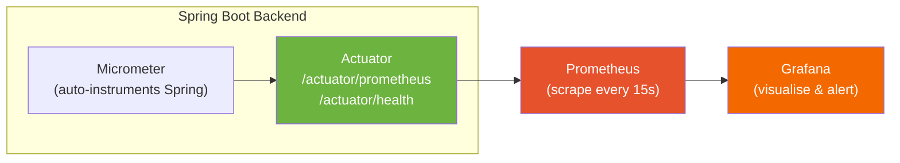

# 🐳 Docura Deployment: Monitoring & Observability Guide

> **Intelligence for Your Documents** — A complete reference for the Docura observability stack: Prometheus metrics collection, Grafana visualization, and Spring Boot Actuator health endpoints.

---

## Table of Contents
1. [Observability Stack Overview](#1-observability-stack-overview)
2. [Spring Boot Actuator Endpoints](#2-spring-boot-actuator-endpoints)
3. [Prometheus: Metrics Collection](#3-prometheus-metrics-collection)
4. [Prometheus Query Reference](#4-prometheus-query-reference)
5. [Grafana: Dashboard Setup](#5-grafana-dashboard-setup)
6. [Recommended Alerts](#6-recommended-alerts)
7. [Accessing Dashboards](#7-accessing-dashboards)
8. [Log Inspection with Docker](#8-log-inspection-with-docker)

---

## 1. Observability Stack Overview



The metrics pipeline:
1. **Micrometer** (bundled with Spring Boot Actuator) automatically instruments: HTTP request durations, JVM memory, HikariCP pool, GC events, and custom application metrics.
2. **Actuator** exposes all metrics at `/actuator/prometheus` in Prometheus exposition format.
3. **Prometheus** scrapes the endpoint every **15 seconds** (as configured in `prometheus.yml`).
4. **Grafana** connects to Prometheus as a data source and renders time-series dashboards.

---

## 2. Spring Boot Actuator Endpoints

The backend exposes the following endpoints. These are configured in `application.yaml`:

```yaml
management:
  endpoints:
    web:
      exposure:
        include: health, metrics, prometheus
```

| Endpoint | URL | Description | Auth Required |
|---|---|---|---|
| `health` | `/actuator/health` | Application health status (UP/DOWN) | No |
| `metrics` | `/actuator/metrics` | Metric names index | No |
| `metrics/{name}` | `/actuator/metrics/http.server.requests` | Specific metric detail | No |
| `prometheus` | `/actuator/prometheus` | All metrics in Prometheus format | No |

> `SecurityConfig.java` includes `/actuator/**` in `permitAll()`, so these endpoints are publicly accessible. They expose no sensitive user data — only system metrics.

### Health Check

```bash
curl http://localhost/api/actuator/health
```

```json
{
  "status": "UP",
  "components": {
    "db": { "status": "UP", "details": { "database": "PostgreSQL" } },
    "diskSpace": { "status": "UP" },
    "ping": { "status": "UP" }
  }
}
```

A `"status": "DOWN"` response indicates a critical component failure — most commonly the database connection.

---

## 3. Prometheus: Metrics Collection

### Prometheus Configuration

`prometheus.yml` (in the deployment repo root):
```yaml
global:
  scrape_interval: 15s   # Collect metrics every 15 seconds

scrape_configs:
  - job_name: 'docura-spring-boot'
    metrics_path: '/actuator/prometheus'
    static_configs:
      - targets: ['backend:8080']   # Docker internal hostname
```

The job name `docura-spring-boot` is the label value used to filter metrics in Grafana queries: `{job="docura-spring-boot"}`.

### Accessing Prometheus UI

```
http://<your-ec2-ip>:9090
```

> Remember to temporarily add your IP to the AWS Security Group for port `9090` before accessing. Remove after use.

### Verify Scraping is Working

In the Prometheus UI:
1. Navigate to **Status → Targets**
2. You should see `docura-spring-boot` with state **UP** and a recent `Last Scrape` timestamp.

---

## 4. Prometheus Query Reference

All key metrics for monitoring Docura. Use these in both the Prometheus UI and Grafana.

### HTTP Traffic

```promql
# Total HTTP requests (all time)
http_server_requests_seconds_count{job="docura-spring-boot"}

# Request rate per minute (5-minute rolling window)
sum(rate(http_server_requests_seconds_count{job="docura-spring-boot"}[5m])) * 60

# Request rate per endpoint (top 10)
topk(10, sum by (uri) (rate(http_server_requests_seconds_count[5m])))

# HTTP error rate (4xx + 5xx)
sum(rate(http_server_requests_seconds_count{status=~"4..|5.."}[5m]))
```

### Latency

```promql
# Average response time (ms)
sum(rate(http_server_requests_seconds_sum[5m])) /
sum(rate(http_server_requests_seconds_count[5m])) * 1000

# 50th percentile (median) latency
histogram_quantile(0.50, rate(http_server_requests_seconds_bucket[5m]))

# 95th percentile latency (p95)
histogram_quantile(0.95, rate(http_server_requests_seconds_bucket[5m]))

# 99th percentile latency (p99) — detect tail latency
histogram_quantile(0.99, rate(http_server_requests_seconds_bucket[5m]))

# Latency per endpoint (p95)
histogram_quantile(0.95, sum by (uri, le) (rate(http_server_requests_seconds_bucket[5m])))
```

### JVM Memory

```promql
# Heap memory used (bytes)
jvm_memory_used_bytes{area="heap"}

# Heap memory as % of max
jvm_memory_used_bytes{area="heap"} / jvm_memory_max_bytes{area="heap"} * 100

# Non-heap (Metaspace, Code cache)
jvm_memory_used_bytes{area="nonheap"}

# GC pause time rate (seconds/second)
rate(jvm_gc_pause_seconds_sum[5m])
```

### Database — HikariCP Connection Pool

```promql
# Active DB connections (in use right now)
hikaricp_connections_active{pool="HikariPool-1"}

# Idle DB connections
hikaricp_connections_idle{pool="HikariPool-1"}

# Total pool size
hikaricp_connections{pool="HikariPool-1"}

# Connection acquisition time (p95)
histogram_quantile(0.95, rate(hikaricp_connections_acquire_seconds_bucket[5m]))

# Connection timeout rate (connections that failed to acquire)
rate(hikaricp_connections_timeout_total[5m])
```

### Spring Data JPA Repositories

```promql
# Repository invocation rate by method
sum by (repository, method) (
  rate(spring_data_repository_invocations_seconds_count[5m])
)

# Slow repository calls (p95 > 100ms)
histogram_quantile(0.95,
  sum by (repository, method, le) (
    rate(spring_data_repository_invocations_seconds_bucket[5m])
  )
)
```

### Document Upload & RAG Pipeline

```promql
# Document upload endpoint throughput
rate(http_server_requests_seconds_count{uri="/api/documents/upload"}[5m])

# Conversation endpoint (RAG chat) throughput
rate(http_server_requests_seconds_count{uri="/api/documents/conversations"}[5m])

# Rate-limited requests (429 responses)
rate(http_server_requests_seconds_count{status="429"}[5m])
```

---

## 5. Grafana: Dashboard Setup

### Step 1: Add Prometheus Data Source

1. Open Grafana at `http://<your-ip>:3000` (default: `admin` / `admin`)
2. **Connections → Data Sources → Add New Data Source**
3. Choose **Prometheus**
4. Set **URL**: `http://prometheus:9090` ← **Use Docker internal hostname, NOT localhost**
5. Click **Save & Test** → should return "Data source is working"

### Step 2: Import Recommended Dashboard

The fastest way to get a useful dashboard is to import from the Grafana Community Library:

1. **Dashboards → Import**
2. Enter ID `**4701**` (Spring Boot 3.x Statistics) → Load
3. Select your Prometheus data source
4. Click **Import**

This gives you pre-built panels for: HTTP request rates, latency percentiles, JVM memory, GC time, and HikariCP pool.

### Step 3: Create a Custom Docura Dashboard

Build a dashboard with these panels for Docura-specific monitoring:

| Panel | Query | Visualization |
|---|---|---|
| **Requests/min** | `sum(rate(http_server_requests_seconds_count[1m])) * 60` | Stat |
| **Error Rate %** | `sum(rate(http_server_requests_seconds_count{status=~"5.."}[5m])) / sum(rate(http_server_requests_seconds_count[5m])) * 100` | Gauge |
| **p95 Latency** | `histogram_quantile(0.95, rate(http_server_requests_seconds_bucket[5m]))` | Time series |
| **Heap Usage %** | `jvm_memory_used_bytes{area="heap"} / jvm_memory_max_bytes{area="heap"} * 100` | Gauge |
| **Active DB Connections** | `hikaricp_connections_active` | Stat |
| **Rate Limited Requests** | `increase(http_server_requests_seconds_count{status="429"}[5m])` | Time series |
| **Docs Uploaded** | `increase(http_server_requests_seconds_count{uri="/api/documents/upload",status="200"}[24h])` | Stat |

---

## 6. Recommended Alerts

Configure these Grafana alert rules to be notified of critical system events (email, Slack webhook, etc.):

| Alert | Condition | Severity |
|---|---|---|
| **High Error Rate** | 5xx rate > 1 req/min for 5 minutes | 🔴 Critical |
| **High Latency** | p95 latency > 2 seconds for 3 minutes | 🟡 Warning |
| **Heap Near Limit** | JVM heap > 85% for 5 minutes | 🔴 Critical |
| **DB Pool Exhausted** | Active connections = max connections for 2 minutes | 🔴 Critical |
| **Backend Down** | Prometheus target `docura-spring-boot` goes DOWN | 🔴 Critical |
| **Rate Limit Spike** | 429 responses > 10/min for 2 minutes | 🟡 Warning |

### Creating an Alert in Grafana

1. Open any time-series panel → **Edit**
2. Go to the **Alert** tab → **Create alert rule**
3. Set the PromQL query, threshold, and evaluation interval
4. Configure notification channel (email, Webhook URL)
5. Save

---

## 7. Accessing Dashboards

### Prerequisites

1. Add your IP to the AWS Security Group for the required port:
   - Prometheus → Port `9090`
   - Grafana → Port `3000`

2. Remove the Security Group rule after you're done monitoring (least-privilege principle).

### URLs

| Service | URL | Default Credentials |
|---|---|---|
| **Prometheus** | `http://<your-ec2-ip>:9090` | No login |
| **Grafana** | `http://<your-ec2-ip>:3000` | `admin` / `admin` (change on first login) |

---

## 8. Log Inspection with Docker

Prometheus and Grafana provide high-level metrics, but logs are essential for root-cause analysis.

### Viewing Backend Logs (Most Important)

```bash
# Stream live logs from the backend (most useful for debugging)
docker compose logs -f backend

# Last 200 lines only
docker compose logs backend --tail=200

# Search for ERROR-level events
docker compose logs backend 2>&1 | grep "ERROR"

# Search for a specific user's activity (by email)
docker compose logs backend 2>&1 | grep "jane.doe@example.com"

# Logs from a specific time window
docker compose logs backend --since="2026-03-01T00:00:00" --until="2026-03-01T06:00:00"
```

### Viewing All Services

```bash
# All services simultaneously
docker compose logs -f

# Specific service: postgres, frontend, prometheus, grafana
docker compose logs -f postgres
docker compose logs -f frontend
```

### Log Levels

Spring Boot logging levels are configured in `application.yaml`:
```yaml
logging:
  level:
    com.webdynamo.documentinsight: INFO   # Application code
    org.springframework.ai: INFO           # Spring AI (embedding, chat)
```

To temporarily increase logging verbosity (for debugging), set environment variable on restart:
```bash
# Add to .env temporarily
LOGGING_LEVEL_COM_WEBDYNAMO_DOCUMENTINSIGHT=DEBUG
docker compose up -d backend
```
